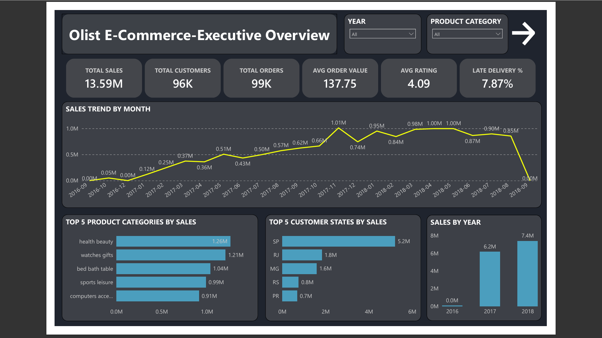
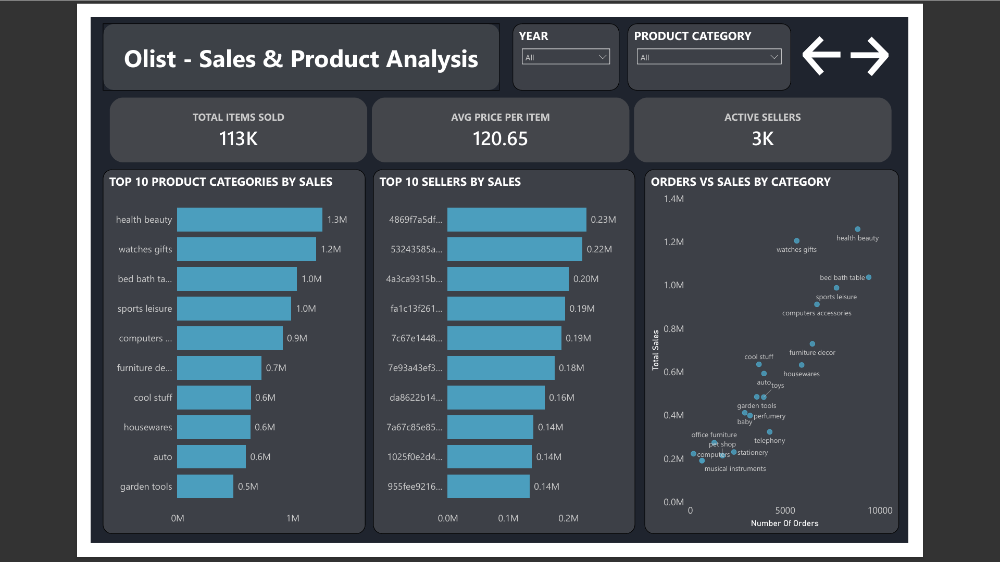
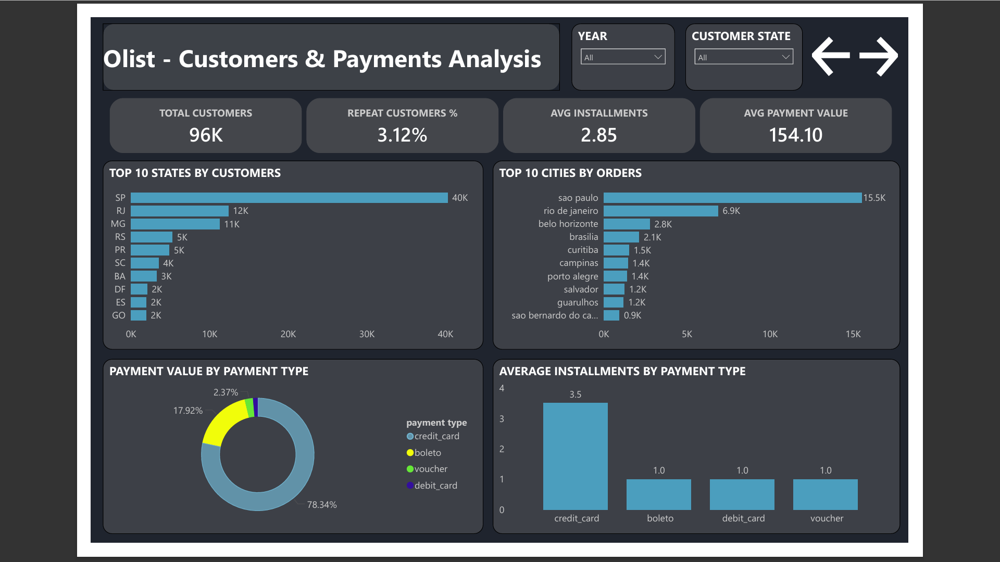
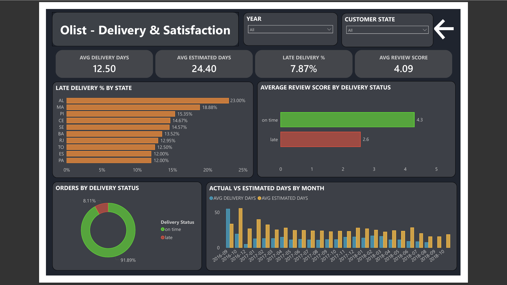

# Olist E-Commerce Analysis | Power BI Dashboard

An end-to-end analysis of the Brazilian Olist e-commerce dataset (Kaggle), built as a 4-page interactive Power BI dashboard covering sales, customers, payments and delivery performance.

## Tools
- Power BI (Power Query, DAX, star-schema data model)
- MySQL (SQL analysis to be added)

## Dataset
Brazilian E-Commerce Public Dataset by Olist (Kaggle): 9 tables covering orders, items, customers, sellers, products, payments and reviews (about 99K orders, 2016-2018).

## Dashboard Pages

### 1. Executive Overview

### 2. Sales and Products

### 3. Customers and Payments

### 4. Delivery and Satisfaction

## Key Insights
1. **Sales:** Total sales of 13.59M across 99K orders and 96K customers, with an average order value of 137.75. Sales peaked in Nov 2017 at about 1.01M, and SP state contributes the most (5.2M).
2. **Products:** Health and beauty (1.26M), watches and gifts (1.21M) and bed, bath and table (1.04M) lead revenue.
3. **Retention:** Only 3.12% of customers placed a repeat order, so there is a clear opportunity to improve loyalty and retention.
4. **Payments:** Credit card accounts for 78% of payment value, with an average of 2.85 installments per payment.
5. **Delivery:** 7.87% of orders arrive late. Late orders score 2.6 on average vs 4.3 for on-time orders. AL (23%) and MA (19%) have the highest late-delivery rates.
6. **Estimates:** Actual delivery averages 12.5 days vs 24.4 estimated days, so Olist's estimates are very conservative.

## Recommendations
- Improve logistics in high-delay states (AL, MA, PI) to protect review scores.
- Launch retention offers and follow-ups to lift the 3% repeat rate.
- Tighten delivery estimates to set more accurate customer expectations.

## DAX Measures Used
Total Sales, Total Customers (distinct customer_unique_id), Repeat Customer %, Late Delivery %, Avg Delivery Days, Avg Estimated Days, Avg Review Score, Avg Installments.

## Author
Kuppam Kandriga Prasanth | Aspiring Data Analyst | Bengaluru, India
